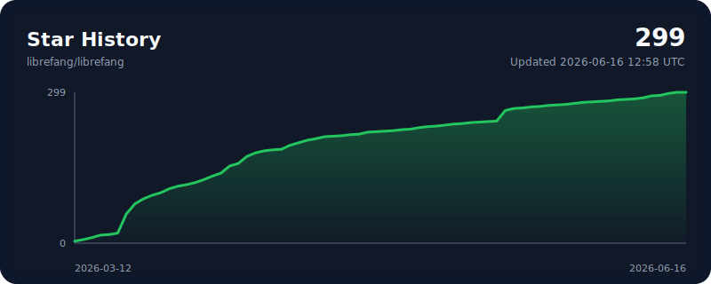

<p align="center">
  
</p>

<h1 align="center">LibreFang</h1>
<h3 align="center">Операційна система вільних агентів — Free as in Freedom</h3>

<p align="center">
  Агентська ОС з відкритим кодом, написана на Rust. 24 крейти. 2100+ тестів. Нуль попереджень clippy.
</p>

<p align="center">
  <a href="../README.md">English</a> | <a href="README.zh.md">中文</a> | <a href="README.ja.md">日本語</a> | <a href="README.ko.md">한국어</a> | <a href="README.es.md">Español</a> | <a href="README.de.md">Deutsch</a> | <a href="README.pl.md">Polski</a> | <a href="README.fr.md">Français</a> | <a href="README.uk.md">Українська</a>
</p>

<p align="center">
  <a href="https://librefang.ai/">Вебсайт</a> &bull;
  <a href="https://docs.librefang.ai">Документація</a> &bull;
  <a href="../CONTRIBUTING.md">Участь у розробці</a> &bull;
  <a href="https://discord.gg/DzTYqAZZmc">Discord</a>
</p>

<p align="center">
  <a href="https://github.com/librefang/librefang/actions/workflows/ci.yml"></a>
  
  
  
  
  <a href="https://discord.gg/DzTYqAZZmc"></a>
  <a href="https://deepwiki.com/librefang/librefang"></a>
</p>

---

## Що таке LibreFang?

LibreFang — це **операційна система агентів (Agent Operating System)**, повноцінна платформа для запуску автономних ШІ-агентів, створена з нуля на Rust. Це не фреймворк для чат-ботів і не Python-обгортка.

Традиційні фреймворки для агентів чекають, поки ви щось введете. LibreFang запускає **агентів, які працюють на вас** — за розкладом, 24/7, моніторячи цілі, генеруючи ліди, керуючи соціальними мережами та надсилаючи звіти на вашу панель приладів (dashboard).

> LibreFang — це форк проекту [`RightNow-AI/openfang`](https://github.com/RightNow-AI/openfang), створений спільнотою з відкритим управлінням та політикою прийняття PR «merge-first». Деталі див. у [GOVERNANCE.md](../GOVERNANCE.md).

<p align="center">
  
</p>

## Швидкий старт

```bash
# Встановлення (Linux/macOS/WSL)
curl -fsSL https://librefang.ai/install.sh | sh

# Або встановлення через Cargo
cargo install --git https://github.com/librefang/librefang librefang-cli

# Запуск — автоматична ініціалізація при першому запуску, панель приладів на http://localhost:4545
librefang start

# Або запустіть майстер налаштування вручну для інтерактивного вибору провайдера
# librefang init
```

<details open>
<summary><strong>Homebrew</strong></summary>

> 🎉 **LibreFang тепер у [homebrew-core](https://github.com/Homebrew/homebrew-core/pull/290413)!**
> Прийнято до офіційного tap Homebrew 2026-07-08 — встановлюйте CLI без налаштувань і без tap.

```bash
brew install librefang              # CLI (стабільна версія) — офіційний homebrew-core
```

Десктопний застосунок і канали передрелізів, як і раніше, публікуються через tap LibreFang:

```bash
brew tap librefang/tap
brew install --cask librefang       # Desktop (стабільна версія)
# Канали бета та RC:
# brew install librefang-beta       # або librefang-rc
# brew install --cask librefang-rc  # або librefang-beta
```

</details>

<details open>
<summary><strong>Arch Linux (pacman)</strong></summary>

> Реєстрація облікових записів AUR тимчасово недоступна.
> Тому LibreFang зараз публікує підписані пакети через свій офіційний репозиторій pacman.

```bash
# Імпортуйте ключ підпису пакетів LibreFang і локально позначте його як довірений
curl -fsSL https://packages.librefang.ai/librefang.gpg -o /tmp/librefang.gpg
sudo pacman-key --add /tmp/librefang.gpg
sudo pacman-key --finger 2C325B0F88706ED99C45E216DD09DC7D3E70E1E9
sudo pacman-key --lsign-key 2C325B0F88706ED99C45E216DD09DC7D3E70E1E9
```

Додайте репозиторій до `/etc/pacman.conf`:

```ini
[librefang]
Server = https://packages.librefang.ai/arch/$arch
```

`librefang-bin` і `librefang-desktop-bin` є незалежними пакетами.
Встановлюйте лише пакет для потрібного вам інтерфейсу.

#### CLI, daemon і вебпанель

```bash
sudo pacman -Syu librefang-bin
```

#### Desktop-додаток (лише x86_64)

```bash
sudo pacman -Syu librefang-desktop-bin
```

Докладніше про пакети та підтримку aarch64 дивіться в [документації репозиторію Arch](../packaging/arch-repo/README.md).

</details>

<details open>
<summary><strong>Docker</strong></summary>

```bash
docker run -p 4545:4545 ghcr.io/librefang/librefang
```

</details>

<details open>
<summary><strong>Хмарне розгортання</strong></summary>

[](https://deploy.librefang.ai) [](https://deploy.librefang.ai) [](https://render.com/deploy?repo=https://github.com/librefang/librefang) [](https://railway.app/template/librefang) [](../deploy/gcp/README.md)

</details>

## Hands: Агенти, які працюють на вас

**Hands** — це автономні пакети можливостей, які запускаються незалежно, за розкладом, без необхідності вводити промпти. Кожен Hand визначається маніфестом `HAND.toml`, системним промптом та необов'язковими файлами `SKILL.md`, що завантажуються з налаштованої директорії `hands_dir`.

Приклади визначень Hands (Researcher, Collector, Predictor, Strategist, Analytics, Trader, Lead, Twitter, Reddit, LinkedIn, Clip, Browser, API Tester, DevOps) доступні в [репозиторії Hands спільноти](https://github.com/librefang-registry/hands).

```bash
# Встановіть Hand спільноти, а потім:
librefang hand activate researcher   # Починає працювати негайно
librefang hand status researcher     # Перевірити прогрес
librefang hand list                  # Переглянути всі встановлені Hands
```

Створіть власний: визначте `HAND.toml` + системний промпт + `SKILL.md`. [Керівництво](https://docs.librefang.ai/agent/skills)

## Архітектура

24 крейти Rust + xtask, модульний дизайн ядра (kernel).

```
librefang-kernel            Оркестрація, воркфлоу, облік витрат, RBAC, планувальник, бюджет
librefang-runtime           Цикл агента, виконання тул, WASM-пісочниця, MCP, A2A
librefang-api               140+ REST/WS/SSE ендпоінтів, OpenAI-сумісний API, панель приладів
librefang-channels          45 адаптерів обміну повідомленнями з лімітами запитів, DM/груповими політиками
librefang-memory            Збереження в SQLite, векторні ембеддінги, сесії, компакшн
librefang-types             Базові типи, відстеження змін (taint tracking), підписи Ed25519, каталог моделей
librefang-skills            60 вбудованих скілів, парсер SKILL.md, маркетплейс FangHub
librefang-hands             Парсер HAND.toml, реєстр Hands, керування життєвим циклом
librefang-extensions        25 темплейтів MCP, сховище AES-256-GCM, OAuth2 PKCE
librefang-wire              Протокол P2P OFP, взаємна автентифікація HMAC-SHA256 (див. примітку)
librefang-cli               CLI, керування демоном, панель приладів TUI, режим MCP-сервера
librefang-desktop           Нативний додаток Tauri 2.0 (трей, сповіщення, гарячі клавіші)
librefang-import            Рушій імпорту/міграції з OpenClaw, LangChain, AutoGPT
librefang-http              Спільний HTTP-клієнт builder, проксі, TLS-резервування
librefang-testing           Тестова інфраструктура: mock-ядро, mock-драйвер LLM та утиліти тестування маршрутів API
librefang-telemetry         Інструментування метрик OpenTelemetry + Prometheus для LibreFang
librefang-llm-driver        Трейт LLM-драйвера та спільні типи для LibreFang
librefang-llm-drivers       Конкретні драйвери провайдерів LLM (anthropic, openai, gemini, …), що реалізують трейт librefang-llm-driver
librefang-runtime-mcp       Клієнт MCP (Model Context Protocol) для рантайму LibreFang
librefang-kernel-handle     Трейт KernelHandle для викликів ядра LibreFang всередині процесу
librefang-kernel-router     Рушій маршрутизації Hands/Темплейтів для ядра LibreFang
librefang-kernel-metering   Облік витрат, застосування квот для ядра LibreFang
xtask                       Автоматизація збірки
```

> **Канал зв'язку OFP є відкритим за дизайном.** Взаємна автентифікація HMAC-SHA256 + 
> HMAC для кожного повідомлення + захист від повторів nonce захищають від *активних* атак, 
> але вміст фреймів не шифрується. Для міжмережевої федерації запускайте OFP за приватним 
> оверлеєм (WireGuard, Tailscale, SSH-тунель) або mTLS-рівнем сервісної сітки.
> Детальніше: [docs.librefang.ai/architecture/ofp-wire](https://docs.librefang.ai/architecture/ofp-wire)

## Ключові особливості

**45 адаптерів каналів** — Telegram, Discord, Slack, WhatsApp, Signal, Matrix, Email, Teams, Google Chat, Feishu, LINE, Mastodon, Bluesky та ще 32. [Повний список](https://docs.librefang.ai/integrations/channels)

**28 провайдерів LLM** — Anthropic, Gemini, OpenAI, Groq, DeepSeek, OpenRouter, Ollama, Alibaba Coding Plan та ще 20. Інтелектуальна маршрутизація, автоматичний перехід на резервні варіанти, відстеження витрат. [Детальніше](https://docs.librefang.ai/configuration/providers)

**16 рівнів безпеки** — WASM-пісочниця, Merkle audit trail, відстеження змін (taint tracking), підписи Ed25519, захист від SSRF, обнулення секретів тощо. [Детальніше](https://docs.librefang.ai/getting-started/comparison#16-security-systems--defense-in-depth)

**OpenAI-сумісний API** — Швидка заміна ендпоінту `/v1/chat/completions`. 140+ REST/WS/SSE ендпоінтів. [Довідник API](https://docs.librefang.ai/integrations/api)

**Клієнтські SDK** — Повноцінний клієнт REST із підтримкою потокової передачі (streaming).

```javascript
// JavaScript/TypeScript
npm install @librefang/sdk
const { LibreFang } = require("@librefang/sdk");
const client = new LibreFang("http://localhost:4545");
const agent = await client.agents.create({ template: "assistant" });
const reply = await client.agents.message(agent.id, "Hello!");
```

```python
# Python
pip install librefang
from librefang import Client
client = Client("http://localhost:4545")
agent = client.agents.create(template="assistant")
reply = client.agents.message(agent["id"], "Hello!")
```

```rust
// Rust
cargo add librefang
use librefang::LibreFang;
let client = LibreFang::new("http://localhost:4545");
let agent = client.agents().create(CreateAgentRequest { template: Some("assistant".into()), .. }).await?;
```

```go
// Go
go get github.com/librefang/librefang/sdk/go
import "github.com/librefang/librefang/sdk/go"
client := librefang.New("http://localhost:4545")
agent, _ := client.Agents.Create(map[string]interface{}{"template": "assistant"})
```

**Підтримка MCP** — Вбудований клієнт та сервер MCP. Підключайтеся до IDE, розширюйте за допомогою власних тул, створюйте конвеєри агентів. [Детальніше](https://docs.librefang.ai/integrations/mcp-a2a)

**Протокол A2A** — Підтримка протоколу Google Agent-to-Agent. Знаходьте, спілкуйтеся та делегуйте таски між системами агентів. [Детальніше](https://docs.librefang.ai/integrations/mcp-a2a)

**Настільний додаток** — Нативний додаток Tauri 2.0 із системним треєм, сповіщеннями та глобальними гарячими клавішами.

**Міграція з OpenClaw** — `librefang migrate --from openclaw` імпортує агентів, історію, скіли та конфігурацію.

## Розробка

```bash
cargo build --workspace --lib                            # Збірка
cargo test --workspace                                   # 2100+ тестів
cargo clippy --workspace --all-targets -- -D warnings    # Нуль попереджень
cargo fmt --all -- --check                               # Перевірка форматування
```

### Коміт змін

Використовуйте `scripts/commit.sh` замість прямого `git commit`, щоб змінені файли Rust були відформатовані через `rustfmt` перед запуском pre-commit хуків:

```bash
scripts/commit.sh -m "feat: add foo"
scripts/commit.sh -F .git/COMMIT_EDITMSG
```

Оболонка запускає `cargo fmt` для індексованих файлів `*.rs`, повторно додає їх до індексу та встановлює м'яке блокування паралельних комітів у тому самому робочому дереві. Усі прапорці передаються команді `git commit` без змін. Якщо `cargo` недоступний, скрипт пропускає форматування та попереджає; pre-commit хук усе одно перевірить коміт.

## Порівняння

Див. [Порівняння](https://docs.librefang.ai/getting-started/comparison#16-security-systems--defense-in-depth) для порівняння бенчмарків та функціоналу з OpenClaw, ZeroClaw, CrewAI, AutoGen та LangGraph.

## Посилання

- [Документація](https://docs.librefang.ai) &bull; [Довідник API](https://docs.librefang.ai/integrations/api) &bull; [Початок роботи](https://docs.librefang.ai/getting-started) &bull; [Вирішення проблем](https://docs.librefang.ai/operations/troubleshooting)
- [Участь у розробці](../CONTRIBUTING.md) &bull; [Управління](../GOVERNANCE.md) &bull; [Безпека](../SECURITY.md)
- Обговорення: [Q&A](https://github.com/librefang/librefang/discussions/categories/q-a) &bull; [Приклади використання](https://github.com/librefang/librefang/discussions/categories/show-and-tell) &bull; [Голосування за функції](https://github.com/librefang/librefang/discussions/categories/ideas) &bull; [Анонси](https://github.com/librefang/librefang/discussions/categories/announcements) &bull; [Discord](https://discord.gg/DzTYqAZZmc)

## Учасники проекту

<a href="https://github.com/librefang/librefang/graphs/contributors">
  
</a>

<p align="center">
  Ми раді будь-якій допомозі — кодом, документацією, перекладами, звітами про помилки.<br/>
  Ознайомтеся з <a href="../CONTRIBUTING.md">Керівництвом для розробників</a> та оберіть <a href="https://github.com/librefang/librefang/issues?q=is%3Aissue+is%3Aopen+label%3A%22good+first+issue%22">хорошу першу таску</a> для старту!<br/>
  Ви також можете відвідати <a href="https://leszek3737.github.io/librefang-WIki/">неофіційну вікі</a>, де зібрано корисну інформацію для нових контриб'юторів.
</p>

<p align="center">
  <a href="https://github.com/librefang/librefang/stargazers">
    
  </a>
</p>

---

<p align="center">MIT License</p>
